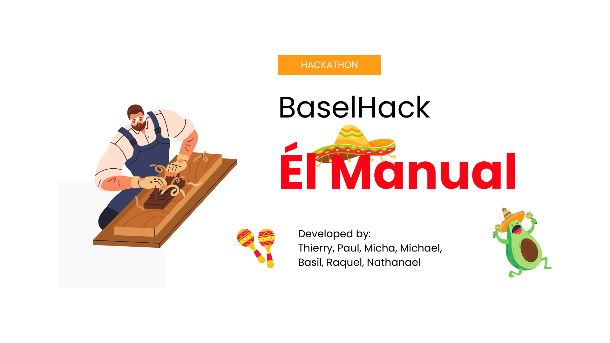

# El Manual - Taco 'Bout Easy Manuals 
[](http://jupyter.org)

[](https://docs.pydantic.dev/)
[](https://pandas.pydata.org)
[](https://numpy.org)
[](https://fastapi.tiangolo.com)


## Project Contributors

Part of the team was:

[Michael Beutler](https://github.com/michaelbeutler) <br>
[Basil Holinger](https://github.com/kinba3000) <br>
[Paul Gesser](https://github.com/paulgeser) <br>
[Raquel Lima](https://github.com/raquelima) <br>
[Thierry Grimm](https://github.com/thierrygrimm) <br>
[Nathanel Thomman](https://github.com/nathanaelthomann) <br>
[Micha Thomman](https://github.com/) <br>


## Project Description

elManual is an application that helps you to automatically create user guides for you based on a sequence of images, turning every step into a fiesta! With our AI, you can upload images, and in a flash, it’ll convert them into clear instructions, sprinkled with just the right amount of humor and zest.

The application emphasizes modular design, user-friendly interaction, and robust processing of images to produce step-by-step guidance. Designed with fun in mind, elManual ensures that your documentation is not only informative but also entertaining.

:star2: Highlights:

Upload up to 10 images at a time and watch as AI transforms them into delightful instructions.
Chatbot optimization helps you refine your text, ensuring it’s as spicy as your favorite salsa.
Fast image processing delivers immediate descriptions, making workflow documentation as easy as guacamole.
Images are processed right after uploading, and the resulting instructions are formatted (specify format X) for easy sharing. Whether you're creating guides for tacos or tech, elManual serves up clear, engaging instructions to keep everyone on the same page.

The application features an intuitive chatbot interface that supports both new uploads and existing photos, making it accessible for everyone from taco vendors to tech gurus. The final product? Instructions that are a taco of the town!

The elManual app combines culinary creativity with cutting-edge technology to ensure your instructions are always a hit!

## Getting started

### Requirements

Make sure all module requirements are met or install them with:

~~~
python -m pip install -r requirements.txt
~~~

Make sure the OpenAI API key is stored within `/code/api/.env` file and can be read from the programm. 


After the dependencies are installed, you can run the backend with the following command in the app directory:

~~~
uvicorn main:app --reload
~~~

## License

```
El Manual - Taco 'Bout Easy Manuals 

The MIT License (MIT)

Copyright (c) 2024 <copyright holders>

Permission is hereby granted, free of charge, to any person obtaining a copy
of this software ("El Manual") and associated documentation 
files (the "Software"), to deal in the Software without restriction, including without
limitation the rights to use, copy, modify, merge, publish, distribute, sublicense, 
and/or sell copies of the Software, and to permit persons to whom the Software is 
furnished to do so, subject to the following conditions:

The above copyright notice and this permission notice shall be included in
all copies or substantial portions of the Software.

THE SOFTWARE IS PROVIDED "AS IS", WITHOUT WARRANTY OF ANY KIND, EXPRESS OR
IMPLIED, INCLUDING BUT NOT LIMITED TO THE WARRANTIES OF MERCHANTABILITY,
FITNESS FOR A PARTICULAR PURPOSE AND NONINFRINGEMENT. IN NO EVENT SHALL THE
AUTHORS OR COPYRIGHT HOLDERS BE LIABLE FOR ANY CLAIM, DAMAGES OR OTHER
LIABILITY, WHETHER IN AN ACTION OF CONTRACT, TORT OR OTHERWISE, ARISING FROM,
OUT OF OR IN CONNECTION WITH THE SOFTWARE OR THE USE OR OTHER DEALINGS IN
THE SOFTWARE.
```

