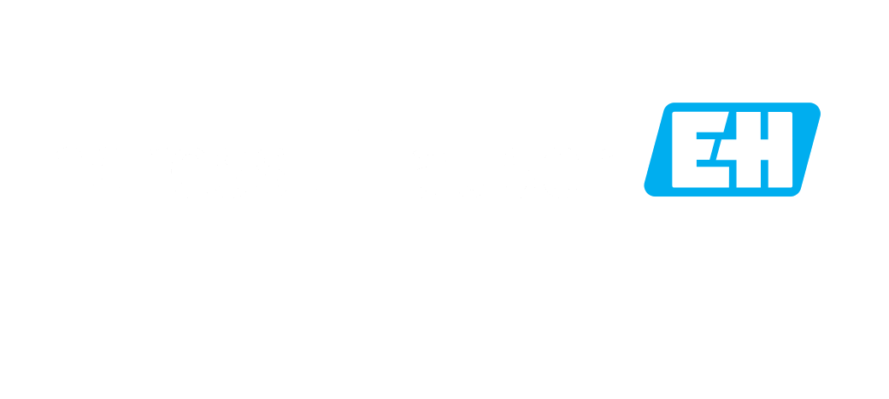

# BaselHack 2024

Welcomme to our BaselHack project 2024. We were inspired by 

## Usability

The main usage of this projekt is to take photo sequenzes and convert this into a manual while using the OpenAI API.

You upload you'r images trough a webUI and get direct feedback trough interactive chatbot. 

